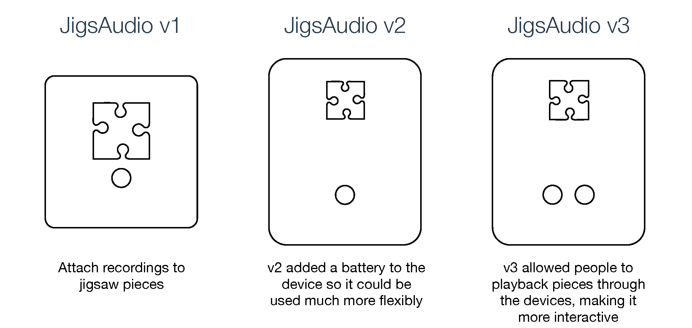

![Image of JigsAudio] (DSC_3127.jpg)

# A Few Details:

This project takes an RFID Tagged Puzzle piece and associates it with an audio clip, stored on a Raspberry Pi. I'm currently  writing instructions on how to make your own JigsAudio device, but in the meantime, please do email me: alexander.wilson@ncl.ac.uk

## What's inside?:
* **caseDesigns:** This folder contains the case designs for the different versions of JigsAudio (.ai and .svg). All of the cases are designed for laser cut 3mm material - usually 3mm perspex but you can what you'd like. The case requires M3 screws and nuts.

* **documentation:** This folder contains documentation on JigsAudio. This is a work in progesss. At the moment it contains the circuit schematic (showing where the leads for the buttons and switches go). 

* **jigsawDesigns:** This folder contains the desgins for the different jigsaw designs. These are easily created (as long as the peices are large enough for RFID tags).

* **templates:** The template folder contains the template for the webpage that will be generated to allow the device to be connected to and listen to the audio.

* **testingScripts:** These are scripts that were used to test the various functions of JigsAudio before they were added to the main script. They test functions such as the lights and buttons to make sure they're wired correctly.

* **website-generator:** These scripts will make the JigsAudio webpage that is used to share the results on a static website.

This project wouldn't be possible without the help and support of Samantha Finnigan, Andy Dow and Sebastian Mellor. Huge huge thanks to everyone that helped me.

This project wouldn't be possible without the help and support of Samantha Finnigan and Andy Dow. A huge huge thanks!

# Recommended Hardware:
The JigsAudio device is made from a number of off the shelf components, some of which are modified to fit within the case. As there are a lot of generic components within the device, the links to them change frequently. Rather than endlessly update these, the considerations for these components are listed. 
* *[USB RFID Reader:](https://www.amazon.co.uk/Contactless-Proximity-Sensor-Reader-125Khz/dp/B00GS18WHS/ref=sr_1_34?ie=UTF8&qid=1478517091&sr=8-34&keywords=rfid+reader)* USB RFID Contactless Proximity Sensor Smart: JigsAudio reads RFID tags that are attached to individual pieces. There are different types of RFID tags and readers. It’s important that these are compatible, so make sure the correct tags are purchased with the reader. When making the device, the casing for the reader is removed and the reader attached with two pieces in the top piece of the device.
* *[RFID Tags - [Amazon](https://www.amazon.co.uk/gp/product/B00M5PC0FG/ref=oh_aui_detailpage_o08_s00?ie=UTF8&psc=1) or [Seritag](https://seritag.com/nfc-tags/22mm-clear-ntag213):* As above, make sure that the tags are compatible with the reader.
* *[Raspberry Pi](https://www.raspberrypi.org/products/raspberry-pi-2-model-b/): Use a model of Raspberry Pi – most of them should work. The case is designed for full size RPs.
* *2x 16mm Momentary Push Button: Make sure resistors are used for the LEDs within the buttons, particularly if using buttons with lower voltages than the RPi provides.
* *{USB Microphone](https://www.amazon.co.uk/Kinobo-Microphone-Desktops-Dictation-Software/dp/B00NSOWWIS/ref=sr_1_9?ie=UTF8&qid=1478520299&sr=8-9&keywords=usb+microphone):* A generic USB microphone is used that is attached to the top case with cable ties. A cheap mic is used. Note: the sound quality playing from the RPi isn’t particually good – there is no dedicated sound card within the device. A USB sound quality can be added to JigsAudio if the audio quality is important
* *WiFI Adaptor:* (if not built into the RPi): Allows for the website to be served from the device, and to listen to and delete recordings, and verify the device is working.

# Notes
To have the JigsAudio Python script run at startup, you need to change the .bashrc file. This file can be found by typing: 'sudo nano /home/pi/.bashrc' (You'll need to enter your password). When you find the file, add the following lines to the end of the file:
    
    echo Running at boot
    sudo python /home/pi/JigsAudio/main.py
    
Exit ('ctrl + x') and reboot ('sudo reboot now')
